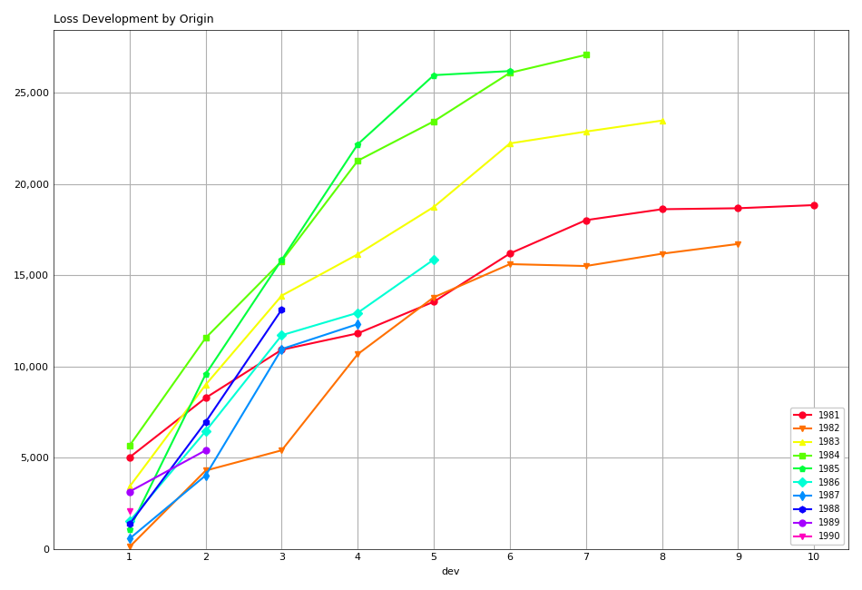

# trikit Quickstart Guide


**Author:**   James D. Triveri   
**Release:** 0.3.0


trikit is a collection of Loss Reserving utilities developed to
facilitate Actuarial analysis in Python, with particular emphasis on
automating the basic techniques generally used for estimating unpaid
claim liabilities. trikit\'s core data structure is the triangle, which
comes in both incremental and cumulative varieties. trikit's triangle
objects inherit directly from Pandas DataFrame, so all of the familiar
methods and attributes used when working in Pandas can be be applied
to trikit triangle objects.

Along with the core `IncrTriangle` and `CumTriangle` data structures,
trikit exposes a few common methods for estimating unpaid claim
liabilities, as well as techniques to quantify variability around those
estimates. Currently available reserve estimators are `BaseChainLadder`,
`MackChainLadder` and `BootstrapChainLadder`. Refer to the examples
below for sample use cases.

Finally, in addition to the library\'s core Chain Ladder functionality,
`trikit` exposes a convenient interface that links to the Casualty
Actuarial Society\'s Schedule P Loss Rerserving Database. The database
contains information on Commercial Auto losses for all property-casualty
insurers that write business in the U.S. More information related to the
the Schedule P Loss Reserving Database can be found
[here](https://www.casact.org/research/index.cfm?fa=loss_reserves_data).


## Installation


trikit can be installed by running:

```sh 
$ python -m pip install trikit 
```


## Quickstart


We begin by loading the RAA sample dataset, which represents Automatic
Factultative business in General Liability provided by the Reinsurance
Association of America. Sample datasets are loaded as DataFrame objects,
and always represent incremental losses. Sample datasets can be loaded
as follows:

```python
In [1]: import trikit
In [2]: raa = trikit.load("raa")
In [3]: raa.head()
Out[3]:
   origin  dev  value
0    1981    1   5012
1    1981    2   3257
2    1981    3   2638
3    1981    4    898
4    1981    5   1734
```

A list of available datasets can be obtained by calling `get_datasets`:

```python
In [4]: trikit.get_datasets()
Out[4]:
['raa', 'ta83', 'lrdb', 'autoliab', 'glre', 'singinjury', 'singproperty']
```

Any of the datasets listed above can be read in the same way using
`trikit.load`. `trikit.load` takes additional arguments to subset
records when accessing the CAS Loss Reserving Database. Refer to the
documentation for more information.

### Working with Triangles

Triangles are created by calling the `totri` function. Available
arguments are:

-   `data`: The dataset to transform into a triangle instance.
-   `tri_type`: {\"cum\", \"incr\"} Specifies the type of triangle to
    create.
-   `data_format`: {\"cum\", \"incr\"} Specifies how losses are
    represented with the input dataset `data`.
-   `data_shape`: {\"tabular\", \"triangle\"} Specifies whether input
    dataset `data` represents tabular loss data with columns \"origin\",
    \"dev\" and \"value\", or data already structured as a loss triangle
    with columns corresponding to development periods.
-   `origin`: The column name in `data` corresponding to accident year.
    Ignored if `data_shape="triangle"`.
-   `dev`: The column name in `data` corresponding to development
    period. Ignored if `data_shape="triangle"`.
-   `value`: The column name in `data` corresponding to the measure of
    interest. Ignored if `data_shape="triangle"`.

Next we demonstrate how to create triangles using `totri` and various
combinations of the arguments listed above.

#### **Example 1:** Create a cumulative loss triangle from tabular incremental data

Referring again to the RAA dataset, let\'s create a cumulative loss
triangle. We mentioned above that trikit sample datasets are Pandas
DataFrames which reflect incremental losses, so `data_format="incr"` and
`data_shape="tabular"`, both of which are defaults. Also, the default
for `tri_type` is `"cum"`, so the only argument required to pass into
`totri` is the input dataset `data`:

```python
In [1]: import pandas as pd
In [2]: from trikit import load, totri
In [3]: raa = load("raa")
In [4]: tri = totri(raa)
In [5]: tri
Out[5]:
        1      2      3      4      5      6      7      8      9      10
1981 5,012  8,269 10,907 11,805 13,539 16,181 18,009 18,608 18,662 18,834
1982   106  4,285  5,396 10,666 13,782 15,599 15,496 16,169 16,704    nan
1983 3,410  8,992 13,873 16,141 18,735 22,214 22,863 23,466    nan    nan
1984 5,655 11,555 15,766 21,266 23,425 26,083 27,067    nan    nan    nan
1985 1,092  9,565 15,836 22,169 25,955 26,180    nan    nan    nan    nan
1986 1,513  6,445 11,702 12,935 15,852    nan    nan    nan    nan    nan
1987   557  4,020 10,946 12,314    nan    nan    nan    nan    nan    nan
1988 1,351  6,947 13,112    nan    nan    nan    nan    nan    nan    nan
1989 3,133  5,395    nan    nan    nan    nan    nan    nan    nan    nan
1990 2,063    nan    nan    nan    nan    nan    nan    nan    nan    nan
```

`tri` is an instance of `trikit.triangle.CumTriangle`, which inherits from pandas.DataFrame:

```python
In [6]: type(tri)
Out[6]: trikit.triangle.CumTriangle
In [7]: isinstance(tri, pd.DataFrame)
Out[7]: True
```

This means that all of the functionality exposed by DataFrame objects
gets inherited by triangle objects. For example, to access the first
column of `tri`:

```python
In [8]: tri.loc[:,1]
Out[8]: 
1981   5012.00000
1982    106.00000
1983   3410.00000
1984   5655.00000
1985   1092.00000
1986   1513.00000
1987    557.00000
1988   1351.00000
1989   3133.00000
1990   2063.00000
Name: 1, dtype: float64
```

Triangle objects offer a number of methods useful in Actuarial reserving
contexts. To extract the latest diagonal, call `tri.latest`:

```python
In [9]: tri.latest
Out[9]:
origin  dev      latest
0    1981   10 18834.00000
1    1982    9 16704.00000
2    1983    8 23466.00000
3    1984    7 27067.00000
4    1985    6 26180.00000
5    1986    5 15852.00000
6    1987    4 12314.00000
7    1988    3 13112.00000
8    1989    2  5395.00000
9    1990    1  2063.00000
```

Calling `tri.a2a` produces a DataFrame of age-to-age factors:

```python
In[10]: tri.a2a
Out[10]:
         1       2       3       4       5       6       7       8       9
1981  1.64984 1.31902 1.08233 1.14689 1.19514 1.11297 1.03326 1.00290 1.00922
1982 40.42453 1.25928 1.97665 1.29214 1.13184 0.99340 1.04343 1.03309     nan
1983  2.63695 1.54282 1.16348 1.16071 1.18570 1.02922 1.02637     nan     nan
1984  2.04332 1.36443 1.34885 1.10152 1.11347 1.03773     nan     nan     nan
1985  8.75916 1.65562 1.39991 1.17078 1.00867     nan     nan     nan     nan
1986  4.25975 1.81567 1.10537 1.22551     nan     nan     nan     nan     nan
1987  7.21724 2.72289 1.12498     nan     nan     nan     nan     nan     nan
1988  5.14212 1.88743     nan     nan     nan     nan     nan     nan     nan
1989  1.72199     nan     nan     nan     nan     nan     nan     nan     nan
```

Calling `tri.a2a_avgs` produces a table of candidate loss development
factors, which contains arithmetic, geometric and weighted age-to-age
averages for a number of different periods:

```python
In[11]: tri.a2a_avgs()
Out[11]:
                 1       2       3       4       5       6       7       8       9
simple-1      1.72199 1.88743 1.12498 1.22551 1.00867 1.03773 1.02637 1.03309 1.00922
simple-2      3.43205 2.30516 1.11517 1.19815 1.06107 1.03347 1.03490 1.01799 1.00922
simple-3      4.69378 2.14200 1.21009 1.16594 1.10261 1.02011 1.03436 1.01799 1.00922
simple-4      4.58527 2.02040 1.24478 1.16463 1.10992 1.04333 1.03436 1.01799 1.00922
simple-5      5.42005 1.88921 1.22852 1.19013 1.12696 1.04333 1.03436 1.01799 1.00922
simple-6      4.85726 1.83148 1.35321 1.18293 1.12696 1.04333 1.03436 1.01799 1.00922
simple-7      4.54007 1.74973 1.31451 1.18293 1.12696 1.04333 1.03436 1.01799 1.00922
simple-8      9.02563 1.69589 1.31451 1.18293 1.12696 1.04333 1.03436 1.01799 1.00922
all-simple    8.20610 1.69589 1.31451 1.18293 1.12696 1.04333 1.03436 1.01799 1.00922
geometric-1   1.72199 1.88743 1.12498 1.22551 1.00867 1.03773 1.02637 1.03309 1.00922
geometric-2   2.97568 2.26699 1.11513 1.19783 1.05977 1.03346 1.03487 1.01788 1.00922
geometric-3   3.99805 2.10529 1.20296 1.16483 1.10019 1.01993 1.03433 1.01788 1.00922
geometric-4   4.06193 1.98255 1.23788 1.16380 1.10802 1.04244 1.03433 1.01788 1.00922
geometric-5   4.73672 1.83980 1.22263 1.18840 1.12492 1.04244 1.03433 1.01788 1.00922
geometric-6   4.11738 1.78660 1.32455 1.18138 1.12492 1.04244 1.03433 1.01788 1.00922
geometric-7   3.86345 1.69952 1.28688 1.18138 1.12492 1.04244 1.03433 1.01788 1.00922
geometric-8   5.18125 1.64652 1.28688 1.18138 1.12492 1.04244 1.03433 1.01788 1.00922
all-geometric 4.56261 1.64652 1.28688 1.18138 1.12492 1.04244 1.03433 1.01788 1.00922
weighted-1    1.72199 1.88743 1.12498 1.22551 1.00867 1.03773 1.02637 1.03309 1.00922
weighted-2    2.75245 2.19367 1.11484 1.19095 1.05838 1.03381 1.03326 1.01694 1.00922
weighted-3    3.24578 2.05376 1.23215 1.15721 1.09340 1.02395 1.03326 1.01694 1.00922
weighted-4    3.47986 1.91259 1.26606 1.15799 1.09987 1.04193 1.03326 1.01694 1.00922
weighted-5    4.23385 1.74821 1.24517 1.17519 1.11338 1.04193 1.03326 1.01694 1.00922
weighted-6    3.30253 1.70935 1.29886 1.17167 1.11338 1.04193 1.03326 1.01694 1.00922
weighted-7    3.16672 1.67212 1.27089 1.17167 1.11338 1.04193 1.03326 1.01694 1.00922
weighted-8    3.40156 1.62352 1.27089 1.17167 1.11338 1.04193 1.03326 1.01694 1.00922
all-weighted  2.99936 1.62352 1.27089 1.17167 1.11338 1.04193 1.03326 1.01694 1.00922
```

We can obtain a reference to an incremental representation of the
cumulative triangle by calling `tri.to_incr`:

```python
In[12]: tri.to_incr()
Out[12]:
        1     2     3     4     5     6     7   8   9   10
1981 5,012 3,257 2,638   898 1,734 2,642 1,828 599  54 172
1982   106 4,179 1,111 5,270 3,116 1,817  -103 673 535 nan
1983 3,410 5,582 4,881 2,268 2,594 3,479   649 603 nan nan
1984 5,655 5,900 4,211 5,500 2,159 2,658   984 nan nan nan
1985 1,092 8,473 6,271 6,333 3,786   225   nan nan nan nan
1986 1,513 4,932 5,257 1,233 2,917   nan   nan nan nan nan
1987   557 3,463 6,926 1,368   nan   nan   nan nan nan nan
1988 1,351 5,596 6,165   nan   nan   nan   nan nan nan nan
1989 3,133 2,262   nan   nan   nan   nan   nan nan nan nan
1990 2,063   nan   nan   nan   nan   nan   nan nan nan nan
```

#### **Example 2:** Create an incremental loss triangle from tabular incremental data

The call to `totri` is identical to Example \#1, but we change
`tri_type` from \"cum\" to \"incr\":

```python
In [1]: import pandas as pd
In [2]: from trikit import load, totri
In [3]: raa = load("raa")
In [4]: tri = totri(raa, tri_type="incr")
In [5]: type(tri)
Out[5]: trikit.triangle.IncrTriangle
In [6]: tri
Out[6]:
        1     2     3     4     5     6     7   8   9   10
1981 5,012 3,257 2,638   898 1,734 2,642 1,828 599  54 172
1982   106 4,179 1,111 5,270 3,116 1,817  -103 673 535 nan
1983 3,410 5,582 4,881 2,268 2,594 3,479   649 603 nan nan
1984 5,655 5,900 4,211 5,500 2,159 2,658   984 nan nan nan
1985 1,092 8,473 6,271 6,333 3,786   225   nan nan nan nan
1986 1,513 4,932 5,257 1,233 2,917   nan   nan nan nan nan
1987   557 3,463 6,926 1,368   nan   nan   nan nan nan nan
1988 1,351 5,596 6,165   nan   nan   nan   nan nan nan nan
1989 3,133 2,262   nan   nan   nan   nan   nan nan nan nan
1990 2,063   nan   nan   nan   nan   nan   nan nan nan nan
```

`tri` now represents RAA losses in incremental format.

It is possible to obtain a cumulative representation of an incremental
triangle object by calling `tri.to_cum`:

```python
In [7]: tri.to_cum()
Out[7]:
        1      2      3      4      5      6      7      8      9      10
1981 5,012  8,269 10,907 11,805 13,539 16,181 18,009 18,608 18,662 18,834
1982   106  4,285  5,396 10,666 13,782 15,599 15,496 16,169 16,704    nan
1983 3,410  8,992 13,873 16,141 18,735 22,214 22,863 23,466    nan    nan
1984 5,655 11,555 15,766 21,266 23,425 26,083 27,067    nan    nan    nan
1985 1,092  9,565 15,836 22,169 25,955 26,180    nan    nan    nan    nan
1986 1,513  6,445 11,702 12,935 15,852    nan    nan    nan    nan    nan
1987   557  4,020 10,946 12,314    nan    nan    nan    nan    nan    nan
1988 1,351  6,947 13,112    nan    nan    nan    nan    nan    nan    nan
1989 3,133  5,395    nan    nan    nan    nan    nan    nan    nan    nan
1990 2,063    nan    nan    nan    nan    nan    nan    nan    nan    nan
```

#### **Example 3:** Create a cumulative loss triangle from data formatted as a triangle

There may be situations in which data is already formatted as a
triangle, and we\'re interested in creating a triangle instance from
this data. In the next example, we create a DataFrame with the same
shape as a triangle, which we then pass into `totri` with
`data_shape="triangle"` to obtain a cumulative triangle instance:

```python
In [1]: import pandas as pd
In [2]: from trikit import load, totri
In [3]: dftri = pd.DataFrame({
            1:[1010, 1207, 1555, 1313, 1905],
            2:[767, 1100, 1203, 900, np.NaN],
            3:[444, 623, 841, np.NaN, np.NaN],
            4:[239, 556, np.NaN, np.NaN, np.NaN],
            5:[80, np.NaN, np.NaN, np.NaN, np.NaN],
            }, index=list(range(1, 6))
            )
In [4]: dftri
Out[4]:
      1     2    3    4   5
1  1010.  767. 444. 239. 80.
2  1207. 1100. 623. 556. nan
3  1555. 1203. 841. nan  nan
4  1313.  900. nan  nan  nan
5  1905.  nan  nan  nan  nan

In [5]: tri = totri(dftri, data_shape="triangle")
In [6]: type(tri)
Out[6]: trikit.triangle.CumTriangle 
```

trikit cumulative triangle instances expose a plot method, which
generates a faceted plot by origin representing the progression of
cumulative losses to date by development period. The exhibit can be
obtained as follows:

```python
In [5]: tri.plot()
```

Which yields:




Reserve Estimators
------------------

trikit includes a number of reserve estimators. Let\'s refer to the CAS
Loss Reserving Dastabase (lrdb) included with trikit, focusing on
`grcode=1767` and `lob="comauto"` (`grcode` uniquely identifies each
company in the database. To obtain a full list of grcodes and associated
companies, use `trikit.get_lrdb_groups()`; to obtain a list of
available lines of business (lobs), use `trikit.get_lrdb_lobs()`):

```python
In [1]: from trikit import load, totri
In [2]: df = load("lrdb", lob="comauto", grcode=1767)
In [3]: tri = totri(df)
In [4]: tri
          1       2       3       4       5         6         7         8         9         10
1988 110,231 263,079 431,216 611,278 797,428   985,570 1,174,922 1,366,229 1,558,096 1,752,096
1989 121,678 279,896 456,640 644,767 837,733 1,033,837 1,233,015 1,432,670 1,633,619       nan
1990 123,376 298,615 500,570 714,683 934,671 1,157,979 1,383,820 1,610,193       nan       nan
1991 117,457 280,058 463,396 662,003 865,401 1,071,271 1,278,228       nan       nan       nan
1992 124,611 291,399 481,170 682,203 889,029 1,101,390       nan       nan       nan       nan
1993 137,902 323,854 533,211 753,639 980,180       nan       nan       nan       nan       nan
1994 150,582 345,110 561,315 792,392     nan       nan       nan       nan       nan       nan
1995 150,511 345,241 560,278     nan     nan       nan       nan       nan       nan       nan
1996 142,301 326,584     nan     nan     nan       nan       nan       nan       nan       nan
1997 143,970     nan     nan     nan     nan       nan       nan       nan       nan       nan
```

To obtain base chain ladder reserve estimates, call the cumulative
triangle's `base_cl` method:

```python
In [5]: result = tri.base_cl()
In [6]: result
Out[6]:
      maturity     cldf emergence     latest   ultimate    reserve
1988        10  1.00000   1.00000  1,752,096  1,752,096          0
1989         9  1.12451   0.88928  1,633,619  1,837,022    203,403
1990         8  1.28233   0.77983  1,610,193  2,064,802    454,609
1991         7  1.49111   0.67064  1,278,228  1,905,977    627,749
1992         6  1.77936   0.56200  1,101,390  1,959,771    858,381
1993         5  2.20146   0.45425    980,180  2,157,822  1,177,642
1994         4  2.87017   0.34841    792,392  2,274,299  1,481,907
1995         3  4.07052   0.24567    560,278  2,280,624  1,720,346
1996         2  6.68757   0.14953    326,584  2,184,053  1,857,469
1997         1 15.62506   0.06400    143,970  2,249,541  2,105,571
total               nan       nan 10,178,930 20,666,007 10,487,077
```

The result is of type `chainladder.BaseChainLadderResult`.

`base_cl` accepts two optional arguments:

-   `tail`: The tail factor, which defaults to 1.0.

* `sel`: Loss development factors, which defaults to \"all-weighted\".
`sel` can be either a string corresponding to a pre-computed pattern
available in `tri.a2a_avgs().index`, or a custom set of loss development
factors as a numpy array or Pandas Series.

Example #2 demonstrated how to access a number of candidate loss
development patterns by calling `tri.a2a_avgs`. Available pre-computed
options for `sel` can be any value present in `tri.a2a_avgs`\'s index.
To obtain a list of available pre-computed loss development factors by
name, run:

```python
In [1]: tri.a2a_avgs().index.tolist()
Out[1]:
['simple-1', 'simple-2', 'simple-3', 'simple-4', 'simple-5', 'simple-6', 'simple-7', 
'simple-8', 'all-simple', 'geometric-1', 'geometric-2', 'geometric-3', 'geometric-4', 
'geometric-5', 'geometric-6', 'geometric-7', 'geometric-8', 'all-geometric', 
'weighted-1', 'weighted-2', 'weighted-3', 'weighted-4', 'weighted-5', 'weighted-6', 
'weighted-7', 'weighted-8', 'all-weighted']
```

If instead of `all-weighted`, a 5-year geometric loss development
pattern is preferred, along with a tail factor of 1.015, the call to
`base_cl` would be modified as follows:

```python
In [1]: tri.base_cl(sel="geometric-5", tail=1.015)
Out[1]:
      maturity     cldf emergence     latest   ultimate    reserve
1988        10  1.01500   0.98522  1,752,096  1,778,377     26,281
1989         9  1.14138   0.87613  1,633,619  1,864,578    230,959
1990         8  1.30157   0.76830  1,610,193  2,095,778    485,585
1991         7  1.51344   0.66075  1,278,228  1,934,517    656,289
1992         6  1.80591   0.55374  1,101,390  1,989,009    887,619
1993         5  2.23416   0.44760    980,180  2,189,878  1,209,698
1994         4  2.91249   0.34335    792,392  2,307,832  1,515,440
1995         3  4.13521   0.24183    560,278  2,316,869  1,756,591
1996         2  6.78292   0.14743    326,584  2,215,194  1,888,610
1997         1 15.69149   0.06373    143,970  2,259,103  2,115,133
total               nan       nan 10,178,930 20,951,135 10,772,205
```

If `sel` is a Series or numpy ndarray, a check will first be made to
ensure the LDFs have the requiste number of elements. The provided LDFs
should not include a tail factor.

Next, reserves are estimated with the chain ladder method along with an
external set of LDFs using the same loss reserve database subset
(`grcode=1767` and `lob="commauto"`):

```python
In [1]: df = load("lrdb", lob="commauto", grcode=1767)
In [2]: tri = totri(df)
In [3]: ldfs = np.asarray([2.75, 1.55, 1.50, 1.25, 1.15, 1.075, 1.03, 1.02, 1.01])
In [4]: cl = tri.base_cl(sel=ldfs)
In [5]: cl
      maturity     cldf emergence     latest   ultimate   reserve
1988        10  1.00000   1.00000  1,752,096  1,752,096         0
1989         9  1.01000   0.99010  1,633,619  1,649,955    16,336
1990         8  1.03020   0.97069  1,610,193  1,658,821    48,628
1991         7  1.06111   0.94241  1,278,228  1,356,335    78,107
1992         6  1.14069   0.87666  1,101,390  1,256,343   154,953
1993         5  1.31179   0.76232    980,180  1,285,793   305,613
1994         4  1.63974   0.60985    792,392  1,299,317   506,925
1995         3  2.45961   0.40657    560,278  1,378,066   817,788
1996         2  3.81240   0.26230    326,584  1,245,068   918,484
1997         1 10.48409   0.09538    143,970  1,509,394 1,365,424
total               nan       nan 10,178,930 14,391,188 4,212,258
```

If `ldfs` is not of the correct length (length `n-1` for a triangle having `n` 
development periods), `ValueError` is raised:

```python
In [6]: ldfs = np.asarray([2.75, 1.55, 1.50, 1.25, 1.15, 1.075, 1.03])
In [7]: result = tri.cl(sel=ldfs)
Traceback (most recent call last):
File "trikit\trikit\chainladder\__init__.py", line 117, in __call__
ValueError: sel has 7 values, LDF overrides require 9.
```

A faceted plot by origin combining actuals and forcasts can be obtained
by calling `result`\'s plot method:

```python
In [1]: result = tri.cl(sel="geometric-5", tail=1.015)
In [2]: result.plot()
```

Which produces the following:


## Quantifying Reserve Variability


The Base Chain Ladder method provides an estimate by origin and in total
of future outstanding claim liabilities, but offers no indication of the
variability around those point estimates. We can obtain quantiles of the
predictive distribution of reserve estimates through a number of trikit
estimators.

### Mack Chain Ladder

The Mack Chain Ladder is a distribution free model which estimates the
first two moments of standard chain ladder forecasts. Within trikit, the
Mack Chain Ladder method is dispatched by calling a cumulative triangle's
`mack_cl` method. `mack_cl` accepts a number of optional arguments:

-   `alpha`: Controls how loss development factors are computed. Can be
    0, 1 or 2. When `alpha=0`, LDFs are computed as the straight average
    of observed individual link ratios. When `alpha=1`, the historical
    Chain Ladder age-to-age factors are computed. When `alpha=2`, a
    regression of \$[C](){k+1}\$ on \$[C](){k}\$ with 0 intercept is
    performed. Default is 1.
-   `dist`: Either \"norm\" or \"lognorm\". Represents the selected
    distribution to approximate the true distribution of reserves by
    origin period and in aggregate. Setting `dist="norm"` specifies a
    normal distribution. `dist="lognorm"` assumes a log-normal
    distribution. Default is "lognorm".
-   `q`: Quantile or sequence of quantiles to compute, which must be
    between 0 and 1 inclusive. Default is [.75, .95].
-   `two_sided`: Whether the two_sided interval should be included in
    summary output. For example, if `two_sided==True` and `q=.95`, then
    the 2.5th and 97.5th quantiles of the estimated reserve distribution
    will be returned ((1 - .95) / 2, (1 + .95) / 2). When False, only
    the specified quantile(s) will be computed. Default value is False.

Using the `ta83` sample dataset, calling `mack_cl` with default
arguments yields:

```python
In [1]: from trikit import load, totri
In [2]: df = load("ta83")
In [3]: tri = totri(data=df)
In [4]: mcl = tri.mack_cl()
In [6]: mcl
Out[6]:
      maturity     cldf emergence     latest   ultimate    reserve std_error      cv        75%        95%
1           10  1.00000   1.00000  3,901,463  3,901,463          0         0     nan        nan        nan
2            9  1.01772   0.98258  5,339,085  5,433,719     94,634    75,535 0.79818    118,760    234,717
3            8  1.09564   0.91271  4,909,315  5,378,826    469,511   121,700 0.25921    539,788    691,334
4            7  1.15466   0.86605  4,588,268  5,297,906    709,638   133,551 0.18820    790,911    947,870
5            6  1.25428   0.79727  3,873,311  4,858,200    984,889   261,412 0.26542  1,135,100  1,462,149
6            5  1.38450   0.72228  3,691,712  5,111,171  1,419,459   411,028 0.28957  1,651,045  2,174,408
7            4  1.62520   0.61531  3,483,130  5,660,771  2,177,641   558,356 0.25640  2,500,779  3,194,587
8            3  2.36858   0.42219  2,864,498  6,784,799  3,920,301   875,430 0.22331  4,439,877  5,499,652
9            2  4.13870   0.24162  1,363,294  5,642,266  4,278,972   971,385 0.22701  4,853,918  6,033,399
10           1 14.44662   0.06922    344,014  4,969,838  4,625,824 1,363,376 0.29473  5,390,689  7,133,025
total               nan       nan 34,358,090 53,038,959 18,680,869 2,447,318 0.13101 20,226,192 22,955,604
```

The `MackChainLadderResult`'s `plot` method returns a faceted plot of
estimated reserve distributions by origin and in total. The mean is
highlighted, along with any quantiles passed to the `plot` method via
`q`. We can compare the estimated distributions when `dist="lognorm"`
vs. `dist="norm"`, highlighting the mean and 95th percentile. First we
take a look at `dist="lognorm"`:

```python
In [7]: mcl.plot()
```

Which produces the following:


Next we produce the same exhibit, this time setting `dist="norm"`:

```python
In [8]: mclargs = {"alpha":1, "dist":"norm", "two_sided":False,}
In [9]: mcl = tri.cl(range_method="mack", **mclargs)
In[10]: mcl.plot()
```

Which generates:


### Testing for Development Period Correlation


In [1] Appendix G., Mack proposes an approximate test to assess whether
one of the basic Chain Ladder assumptions holds, namely that subsequent
development periods are uncorrelated. The test can be performed via
`MackChainLadderResult`'s `devp_corr_test` method. We next apply the
test to the RAA dataset:

```python
In [1]: from trikit import load, totri
In [2]: df = load("raa")
In [3]: tri = totri(data=df)
In [4]: mcl = tri.mack_cl()
In [5]: mcl.devp_corr_test()
Out[5]: ((-0.12746658149149367, 0.12746658149149367), 0.0695578231292517)
```

`devp_corr_test` returns a 2-tuple: The first element represents the
bounds of the test interval ((-0.127, 0.127)). The second element is the
test statistic for the triangle under consideration. In this example,
the test statistic falls within the bounds of the test interval,
therefore we do not reject the null-hypothesis of having uncorrelated
development factors. If the test statistic falls outside the interval,
the correlations should be analyzed in more detail. Refer to \[1\] for
more information.

### Testing for Calendar Year Effects

In [1] Appendix H., Mack proposes a test to assess the independence of
the origin periods. This test can be performed via
`MackChainLadderResult`'s `cy_effects_test` method. Again using the RAA
dataset:

```python
In [1]: from trikit import load, totri
In [2]: df = load("raa")
In [3]: tri = totri(data=df)
In [4]: mcl = tri.mack_cl()
In [5]: mcl.cy_effects_test()
Out[5]: ((8.965613354894957, 16.78438664510504), 14.0)
```

Similar to `devp_corr_test`, `cy_effects_test` returns a 2-tuple, with
the first element representing the bounds of the test interval ((8.97,
16.78)) and the second element the test statistic. In this example, the
test statistic falls within the bounds of thew test interval, therefore
we do not reject the null-hypothesis of not having significant calendar
year influences. Refer to [1] for more information.

### Mack Chain Ladder Diagnostics

`MackChainLadderResult` exposes a `diagnostics` method, which generates
a faceted plot that includes the estimated aggregate reserve
distribution, development by origin and standardized residuals by
development period and by origin:

```python
In [1]: from trikit import load, totri
In [2]: df = load("raa")
In [3]: tri = totri(data=df)
In [4]: mcl = tri.mack_cl()
In [5]: mcl.diagnostics()
```

Which produces the following:


### Bootstrap Chain Ladder


The purpose of the Bootstrap Chain Ladder is to estimate the predicition
error of the total reserve estimate and to approximate the predictive
distribution. Within trikit, the Bootstrap Chain Ladder is encapsulated
within a cumulative triangle's `boot_cl` method. `boot_cl` accepts a
number of optional arguments:

-   `sims`: The number of bootstrap iterations to perform. Default value
    is 1000.
-   `q`: Quantile or sequence of quantiles to compute, which must be
    between 0 and 1 inclusive. Default value is \[.75, .95\].
-   `procdist`: The distribution used to incorporate process variance.
    Currently, this can only be set to \"gamma\". This may change in a
    future release.
-   `two_sided`: Whether the two_sided prediction interval should be
    included in summary output. For example, if `two_sided=True` and
    `q=.95`, then the 2.5th and 97.5th quantiles of the predictive
    reserve distribution will be returned \[(1 - .95) / 2, (1 + .95) /
    2\]. When False, only the specified quantile(s) will be included in
    summary output. Default value is False.
-   `parametric`: If True, fit standardized residuals to a normal
    distribution via maximum likelihood, and sample from the
    parameterized distribution. Otherwise, sample with replacement from
    the collection of standardized fitted triangle residuals. Default
    value is False.
-   `interpolation`: One of {'linear', 'lower', 'higher', 'midpoint', 'nearest'}. 
    Default value is 'linear'. Refer to
    [numpy.quantile](https://numpy.org/devdocs/reference/generated/numpy.quantile.html)
    for more information.
-   `random_state`: If int, random_state is the seed used by the random
    number generator; If `RandomState` instance, random_state is the
    random number generator; If None, the random number generator is the
    `RandomState` instance used by np.random. Default value is None.

We next demonstrate how to apply the Bootstrap Chain Ladder to the RAA
dataset. The example sets `sims=2500`, `two_sided=True` and
`random_state=516` for reproducability:

```python
In [1]: from trikit import load, totri
In [2]: df = load("raa")
In [3]: tri = totri(data=df)
In [4]: bcl = tri.boot_cl(sims=2500, two_sided=True, random_state=516)
In [5]: bcl
Out[1]:
      maturity    cldf emergence  latest ultimate reserve   2.5%  12.5%  87.5%   97.5%
1981        10 1.00000   1.00000  18,834   18,834       0      0      0      0       0
1982         9 1.00922   0.99087  16,704   16,858     154   -691    -71    543   1,610
1983         8 1.02631   0.97437  23,466   24,083     617 -1,028   -100  1,727   3,115
1984         7 1.06045   0.94300  27,067   28,703   1,636   -518    227  3,351   5,129
1985         6 1.10492   0.90505  26,180   28,927   2,747     50    859  4,826   7,209
1986         5 1.23020   0.81288  15,852   19,501   3,649    724  1,688  5,986   8,226
1987         4 1.44139   0.69377  12,314   17,749   5,435  1,536  2,730  8,622  11,521
1988         3 1.83185   0.54590  13,112   24,019  10,907  4,477  6,577 15,557  20,131
1989         2 2.97405   0.33624   5,395   16,045  10,650  2,824  5,452 16,603  21,204
1990         1 8.92023   0.11210   2,063   18,402  16,339    565  5,164 29,130  41,923
total              nan       nan 160,987  213,122  52,135  7,938 22,526 86,344 120,069
```

`reserve` represents the median of the predicitive distribution of reserve estimates 
by origin and in total, and `2.5%`, `12.5%`, `87.5%` and `97.5%` represent various 
percentiles of the predictive distribution of reserve estimates. The lower
percentiles, `2.5%` and `12.5%` are included since `two_sided=True`.

The `BoostrapChainLadderResult` object includes two exhibits: The first
is similar to `BaseChainLadderResult`'s `plot`, but includes the upper
and lower bounds of the specified quantile of the predictive
distribution. To obtain the faceted plot showing the 5th and 95th
percentiles, run:

```python
In [2]: bcl = tri.boot_cl(sims=2500, two_sided=True, random_state=516)
In [2]: bcl.plot(q=.90)
```

Resulting in:


In addition, we can obtain a faceted plot of the distribution of
bootstrap samples by origin and in aggregate by calling
`BoostrapChainLadderResult`\'s `hist` method:

```python
In [4]: bcl.hist()
```

Which generates:


There are a number of parameters which can be used to control the style of the
generated exhibits. Refer to the docstring for more information.

## References


1.  Mack, Thomas (1993) *Measuring the Variability of Chain Ladder
    Reserve Estimates*, 1993 CAS Prize Paper Competition on
    \'Variability of Loss Reserves\'.
2.  Mack, Thomas, (1993), *Distribution-Free Calculation of the Standard
    Error of Chain Ladder Reserve Estimates*, ASTIN Bulletin 23, no.
    2:213-225.
3.  Mack, Thomas, (1999), *The Standard Error of Chain Ladder Reserve
    Estimates: Recursive Calculation and Inclusion of a Tail Factor*,
    ASTIN Bulletin 29, no. 2:361-366.
4.  England, P., and R. Verrall, (2002), *Stochastic Claims Reserving in
    General Insurance*, British Actuarial Journal 8(3): 443-518.
5.  Murphy, Daniel, (2007), *Chain Ladder Reserve Risk Estimators*, CAS
    E-Forum, Summer 2007.
6.  Carrato, A., McGuire, G. and Scarth, R. 2016. *A Practitioner's
    Introduction to Stochastic Reserving*, The Institute and Faculty of
    Actuaries. 2016.

## Contact


Please contact james.triveri@gmail.com with suggestions or feature
requests.

## Relevant Links


- trikit Source: https://github.com/trikit/trikit
- CAS Loss Reserving Database: https://www.casact.org/research/index.cfm?fa=loss_reserves_data
- Python: https://www.python.org/
- Numpy: http://www.numpy.org/
- Scipy: https://docs.scipy.org/doc/scipy/reference/
- Pandas: https://pandas.pydata.org/
- Matplotlib: https://matplotlib.org/
- Seaborn: https://seaborn.pydata.org/
